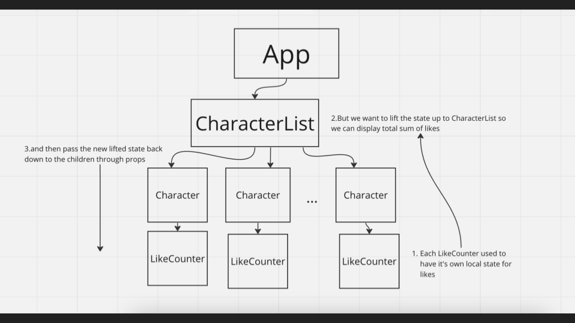

# Getting Started with Create React App

This project was created with [Create React App](https://github.com/facebook/create-react-app)

## Setup

- Git clone this repo
- Run `npm install` to install all the dependencies listed in package.json
- Run `npm run start` to start the local development server

## Branches

Check out the different branches to see how this repo evolved over a week of React lectures

- (main) React components & props
- (react-state) React state with useState & useEffect

You can see the changes from day to day in the ["Pull Requests"](https://github.com/TechmongersNL/fs04-react/pulls) in this repo

## What are React Hooks?

- Functions that let you perform a specific task inside React, like "hooking into" React state or component lifecycles
- Start with the word "use" -- useState and useEffect for example
- Pieces of code (functions) that someone wrote
- Hooks can be inside React or you can import them from somewhere else (like Redux that we'll learn next week), but today we'll focus on just useState and useEffect from React
- You can write your own hooks (custom hooks)

## useState

- A hook that creates state variables that React listens to. It "reacts" when the values of these state variables change
- Used when we have variables whose value should change when an event happens (user generated)
- When the value of the state variable changes, React re-renders the component in a efficient, optimized way for you

## useEffect

- A hook thats used when you want React to re-render without user interaction
- Used to fetch data (async)
- Helps control the amount of re-renders on the page

Fetching data from API flow

1. Write an async function
2. Make a request with axios
3. Console.log what I'm getting back to make sure it's what I expect (and don't forget to call the function)
4. Import useEffect from 'react'
5. Call the async function inside useEffect
6. Check my console.log and put the data in the state
7. React will render something on the screen based on state

## Lifting state diagram

